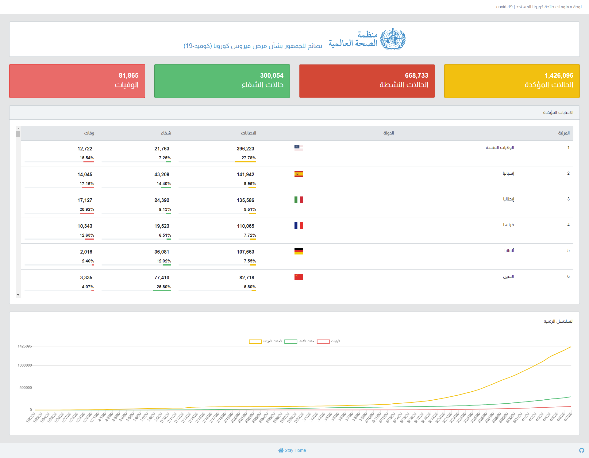

# covid-19 Dashboard (covid-19 لوحة معلومات)

Dashboard aims to present stats of pandemic coronavirus (covid19) in Arabic.

## Getting Started

Just download as zip or clone the repo using `git clone`.

### Prerequisites

Node.js

### Installing

 1. Navigate to the repo.
 2. Install project dependices
  `npm i`
  
 3. Run the project by executing start script
 `npm run start`

## Tests

Since this project was rushed out, no tests available.

## Deployment

You can easily deploy this project using Zeit/now.

## Built With

* [React](http://reactjs.org) - Client App
* [npm](https://npmjs.com/) - Package Manager

## Contributing

Feel free to fork the project and add more features to it.

## Authors

* **Abdelsalam Shahlol**  - [Github](https://github.com/abdelsalamshahlol)

## Acknowledgments
Thanks to [Nuttaphat Arunoprayoch](https://github.com/nat236919) for making [covid-API](https://github.com/nat236919/covid19-api).
